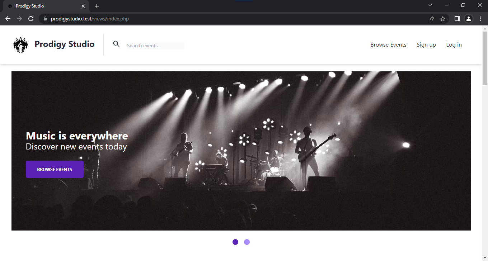
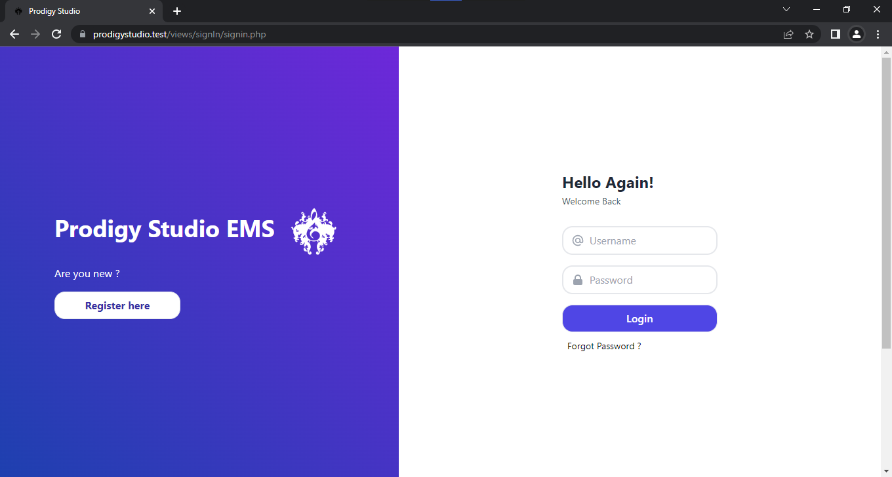
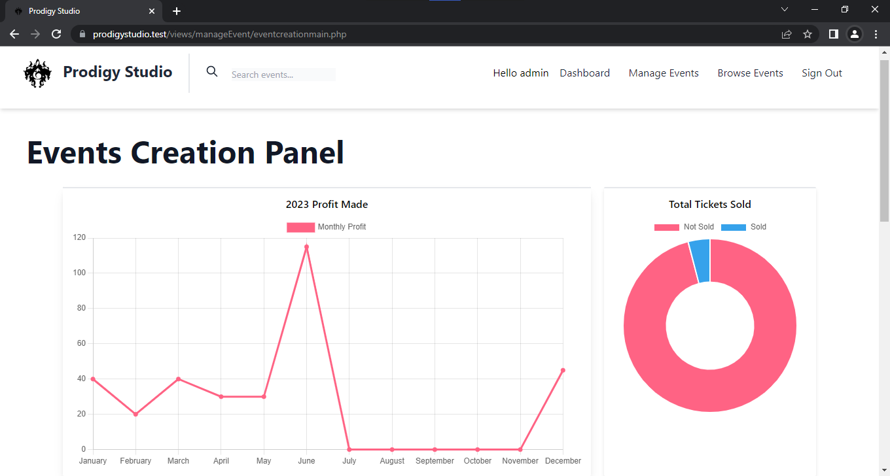
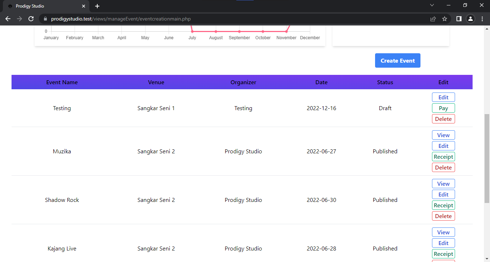
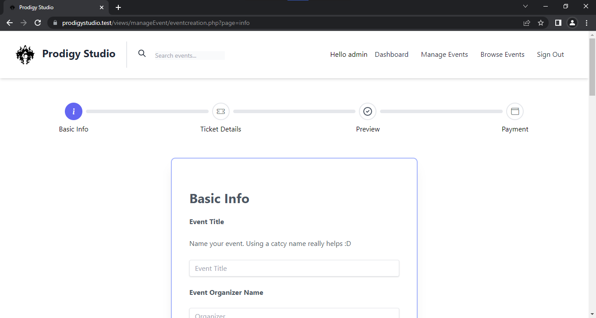
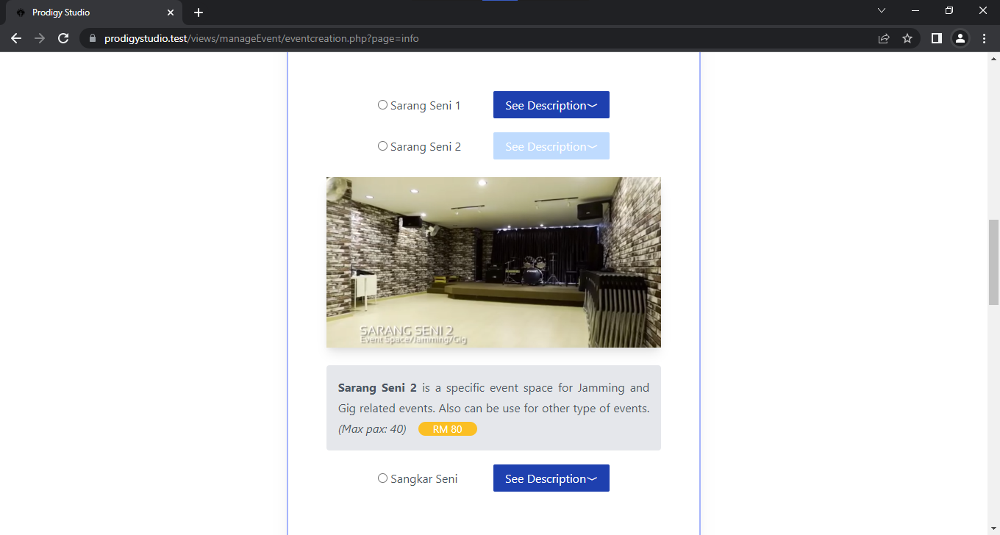

<!-- PROJECT SHIELDS -->
<!--
*** Template by https://github.com/othneildrew/Best-README-Template/blob/master/README.md
*** See the bottom of this document for the declaration of the reference variables
*** for contributors-url, forks-url, etc. This is an optional, concise syntax you may use.
*** https://www.markdownguide.org/basic-syntax/#reference-style-links
-->

[![LinkedIn][linkedin-shield]][linkedin-url]

<!-- PROJECT LOGO -->
 

  

  <h3 align="center">Prodigy Studio Musical Management System</h3>
  

    A musical management system specifically made for a local music studio located in Kajang, Selangor
     
     
    <a href="https://prodigystudio.live">View Demo (Active until 24/7/2022)</a>  
  

<!-- TABLE OF CONTENTS -->

  
Table of Contents

  <ol>  
    <li>
      <a href="#about-the-project">About The Project</a>
      <ul>
        <li><a href="#built-with">Built With</a></li>
      </ul>
    </li>
    <li>
      <a href="#getting-started">Getting Started</a>
      <ul>
        <li><a href="#prerequisites">Prerequisites</a></li>
        <li><a href="#installation">Installation</a></li>
      </ul>
    </li>
    <li><a href="#usage">Usage</a></li>    
    <li><a href="#contact">Contact</a></li>
    <li><a href="#acknowledgments">Acknowledgments</a></li>
  </ol>

<!-- ABOUT THE PROJECT -->
## About The Project

[![Prodigy Studio][product-screenshot]](https://github.com/hisunn/ProdigyStudio/tree/master/readme_content/Demo.gif)

* This project is a final year project made by Ihsan bin Dzahri for Universiti Tun Hussein Onn Malaysia (UTHM)
* The time frame of the project development is during the pandemic
* By the time of you guys reading this readme, bear in mind some things may had became redundant

The purpose of this system creation is to solve Prodigy Studio event management problem, the problem are listed as below:
* The current system are mostly manual using log books to handle event booking
* Human error when using inconsistent method of taking events booking and such
* There are simply no medium for people to buy ticket to attend events held @ prodigy studio

Therefore this project is born !

(<a href="#top">back to top</a>)

### Built With

This section should list any major frameworks/libraries used to bootstrap your project. Leave any add-ons/plugins for the acknowledgements section. Here are a few examples.

* [![Laragon][Laragon.com]][Laragon-url]
* [![Php][Php.net]][Php-url]
* [![JQuery][JQuery.com]][JQuery-url]
* [![Tailwind][Tailwindcss.com]][Tailwind-url]
* [![Bootstrap][Bootstrap.com]][Bootstrap-url]
* [![Html][Html.com]][Html-url]
* [![Css][Css.com]][Css-url]
* [![Npm][Npm.com]][Npm-url]

(<a href="#top">back to top</a>)

<!-- GETTING STARTED -->
## Getting Started

To run this system locally, I recommend using laragon as the system is developed using it.

### Prerequisites

* Install laragon 

* Install Visual Studio Code

### Installation

_Below is the steps that should help you setup the system locally_

1. Clone the repository into www/ folder in laragon
2. use the .sql file to clone the database and its tables
3. Right click laragon, choose www>project_name
4. The system should run locally :smile:

(<a href="#top">back to top</a>)

<!-- USAGE EXAMPLES -->
## Snapshot of System

(<a href="#top">back to top</a>)

<!-- CONTACT -->
## Contact
Hit me up !

Ihsan Dzahri - [@hisunn](https://github.com/hisunn) 

Project Link: [https://github.com/hisunn/ProdigyStudio](https://github.com/hisunn/ProdigyStudio)

(<a href="#top">back to top</a>)

<!-- ACKNOWLEDGMENTS -->
## Acknowledgments

Use this space to list resources you find helpful and would like to give credit to. I've included a few of my favorites to kick things off!

* [Choose an Open Source License](https://choosealicense.com)
* [Malven's Flexbox Cheatsheet](https://flexbox.malven.co/)
* [Malven's Grid Cheatsheet](https://grid.malven.co/)
* [Img Shields](https://shields.io)
* [Font Awesome](https://fontawesome.com)
* [Png Repo](https://www.pngrepo.com/svg/21667/free)
* [Svg Repo](https://www.svgrepo.com)
* [Bootstrap Icon](https://icons.getbootstrap.com)
* [Alpine Js](https://alpinejs.dev/)

(<a href="#top">back to top</a>)

<!-- MARKDOWN LINKS & IMAGES -->
<!-- https://www.markdownguide.org/basic-syntax/#reference-style-links -->
[contributors-shield]: https://img.shields.io/github/contributors/othneildrew/Best-README-Template.svg?style=for-the-badge
[contributors-url]: https://github.com/othneildrew/Best-README-Template/graphs/contributors
[forks-shield]: https://img.shields.io/github/forks/othneildrew/Best-README-Template.svg?style=for-the-badge
[forks-url]: https://github.com/othneildrew/Best-README-Template/network/members
[stars-shield]: https://img.shields.io/github/stars/othneildrew/Best-README-Template.svg?style=for-the-badge
[stars-url]: https://github.com/othneildrew/Best-README-Template/stargazers
[issues-shield]: https://img.shields.io/github/issues/othneildrew/Best-README-Template.svg?style=for-the-badge
[issues-url]: https://github.com/othneildrew/Best-README-Template/issues
[license-shield]: https://img.shields.io/github/license/othneildrew/Best-README-Template.svg?style=for-the-badge
[license-url]: https://github.com/othneildrew/Best-README-Template/blob/master/LICENSE.txt
[linkedin-shield]: https://img.shields.io/badge/-LinkedIn-black.svg?style=for-the-badge&logo=linkedin&colorB=555
[linkedin-url]: https://www.linkedin.com/in/ihsan-dzahri-7095361a5/
[product-screenshot]: images/screenshot.png
[Bootstrap.com]: https://img.shields.io/badge/Bootstrap-563D7C?style=for-the-badge&logo=bootstrap&logoColor=white
[Bootstrap-url]: https://getbootstrap.com
[JQuery.com]: https://img.shields.io/badge/jQuery-0769AD?style=for-the-badge&logo=jquery&logoColor=white
[JQuery-url]: https://jquery.com
[Tailwindcss.com]:https://img.shields.io/badge/TailwindCSS-07b0ce?style=for-the-badge&logo=TailwindCSS&logoColor=white 
[Tailwind-url]:https://tailwindcss.com/
[Php.net]:https://img.shields.io/badge/PHP-697AB1?style=for-the-badge&logo=Php&logoColor=white
[Php-url]:https://www.php.net/
[Html.com]:https://img.shields.io/badge/HTML-e96228?style=for-the-badge&logo=Html5&logoColor=white
[Html-url]:https://html.com/
[Css.com]:https://img.shields.io/badge/CSS-2862e9?style=for-the-badge&logo=Css3&logoColor=white
[Css-url]:https://developer.mozilla.org/en-US/docs/Web/CSS
[Npm.com]:https://img.shields.io/badge/NPM-c53635?style=for-the-badge&logo=Npm&logoColor=white
[Npm-url]:https://www.npmjs.com/
[Laragon.com]:https://img.shields.io/badge/Laragon-36a4ff?style=for-the-badge&logo=Laragon&logoColor=white
[Laragon-url]:https://laragon.org/